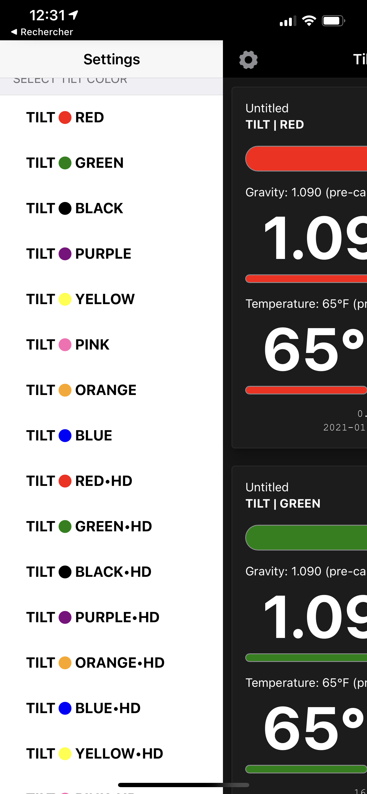

# Tilt-Sim

An ESP32-based [Tilt](https://tilthydrometer.com/) Hydrometers Simulator.

## Description

Useful for developing/debugging Tilt clients and tools. A single ESP32 device can simulate multiple (16) Tilt / Tilt Pro devices.

The device will also show a simple HTML page when accessed. For example:

```bash
# use Bonjour (mDNS) to open the web page and have it refresh every 5 seconds
$ open http://tilt-sim.local./?refresh=5
```

Using the simple REST API you can script, e.g. several `curl` calls, a (condensed) fermentation session to test your software.

```bash
# turn all tilts off - they are all active by default
$ curl "http://tilt-sim.local./setTilt?name=*&active=off"
# acticate the purple tilt
$ curl "http://tilt-sim.local./setTilt?name=purple&active=on&sg=1.2001&temp=65.1"
# there's too much precision for the older tilt but it would be fine with the pro version
$ curl "http://tilt-sim.local./setTilt?name=red*hd&active=on&sg=1.2001&temp=65.1"
```

## Build

You can build this project using [VSCode](https://code.visualstudio.com) and [PlatformIO](https://platformio.org).

You'll need to define `SSID` and `PASSWORD` to match your wifi environment.

## History

In early 2021 (which means confined at home) I had both an idea and time to update my BLE-WiFi bridge for my tilt hydrometers. However the tilts were busy doing their **real** job... but I did have a few ESP32 controllers doing *nothing*. Yet another project was born :-)

## Screenshot



## Ideas

This code could be adapted to:

* Create other iBeacon simulators
* Relay the bluetooth signal to the original app. The Bluetooth-only app could show you the data coming from anywhere in the world.
  * Tilt -> BLE -> Bridge -> Wifi -> {internet} -> Sim -> BLE -> app
